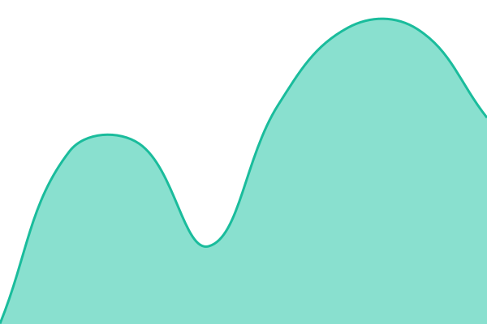
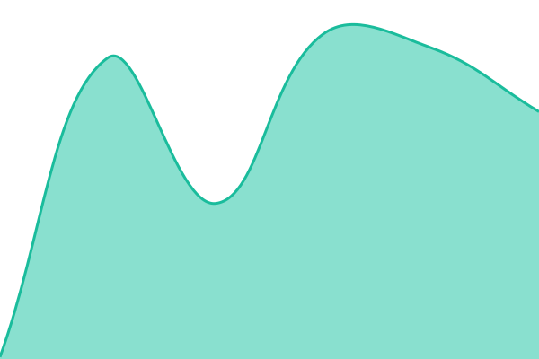

# [📈 Live Status](https://lovelive-academy.github.io/status-page): <!--live status--> **🟩 All systems operational**

This repository contains the open-source uptime monitor and status page for [lovelive-academy](https://lovelive-academy.github.io/status-page), powered by [Upptime](https://github.com/upptime/upptime).

With [Upptime](https://upptime.js.org), you can get your own unlimited and free uptime monitor and status page, powered entirely by a GitHub repository. We use [Issues](https://github.com/lovelive-academy/status-page/issues) as incident reports, [Actions](https://github.com/lovelive-academy/status-page/actions) as uptime monitors, and [Pages](https://lovelive-academy.github.io/status-page) for the status page.

<!--start: status pages-->
<!-- This summary is generated by Upptime (https://github.com/upptime/upptime) -->
<!-- Do not edit this manually, your changes will be overwritten -->
<!-- prettier-ignore -->
| URL | Status | History | Response Time | Uptime |
| --- | ------ | ------- | ------------- | ------ |
|  [学会ホームページ](https://www.lovelive-academy.com) | 🟩 Up | [学会ホームページ.yml](https://github.com/lovelive-academy/status-page/commits/HEAD/history/学会ホームページ.yml) | 

 452ms
     
 | 

<a href="https://lovelive-academy.github.io/status-page/history/学会ホームページ">100.00%</a>
    

|  [聖地巡礼マップ](https://seichi.lovelive-academy.com) | 🟩 Up | [聖地巡礼マップ.yml](https://github.com/lovelive-academy/status-page/commits/HEAD/history/聖地巡礼マップ.yml) | 

 134ms
     
 | 

<a href="https://lovelive-academy.github.io/status-page/history/聖地巡礼マップ">100.00%</a>
    

<!--end: status pages-->

[**Visit our status website →**](https://lovelive-academy.github.io/status-page)

## 📄 License

- Powered by: [Upptime](https://github.com/upptime/upptime)
- Code: [MIT](./LICENSE) © [Anand Chowdhary](https://anandchowdhary.com)
- Data in the `./history` directory: [Open Database License](https://opendatacommons.org/licenses/odbl/1-0/)
